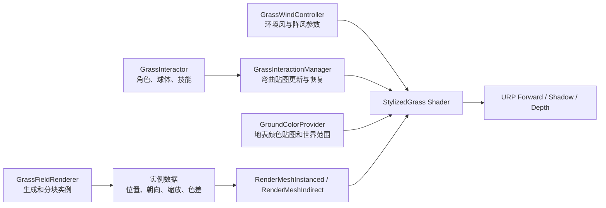

# Unity 风格化草技术验证设计

日期：2026-07-15

## 1. 项目摘要

本验证项目复现 Staggart Creations「Stylized Grass Shader」所体现的核心观感：成片风浪、角色压草、地表颜色融合、草簇色差、柔和卡通光照和逆光透射。

选定技术路线为 **Unity 6 + URP + 手写 HLSL Shader + 草簇 Mesh + GPU Instancing**。验证先采用 Unity 6 推荐的 `Graphics.RenderMeshInstanced` 建立视觉基线，再用 `Graphics.RenderMeshIndirect` 和 Compute Shader 验证更高实例数量下的性能上限。

## 2. 目标与非目标

### 2.1 目标

- 在约 `100m × 100m` 的验证场景中渲染 5 万至 20 万个草簇实例。
- 实现两层风动画：连续环境风和成片移动的阵风。
- 实现角色或球形影响源经过时的定向压草与自动恢复。
- 让草根颜色与地表自然衔接，并用世界空间噪声和实例参数消除重复感。
- 实现稳定的卡通明暗与逆光透射效果。
- 验证分块、距离淡出和 GPU 实例渲染的可行性。
- 在预设测试硬件上记录 1440p 分辨率的 GPU 耗时；初始期望是草地渲染约 `2ms`，但该数值是性能参考，不作为跨硬件的绝对承诺。

### 2.2 非目标

- 不实现开放世界流式加载、存档或网络同步。
- 不制作完整的草地编辑器、地形绘制工具或第三方植被系统集成。
- 不支持 Built-in Render Pipeline、HDRP、移动端或虚拟现实设备。
- 不模拟单根草叶的物理碰撞、割草、燃烧、生长或永久压痕。
- 不以 Geometry Shader 或 Tessellation Shader 作为主生成方案。

## 3. 成功标准

验证通过需要同时满足以下条件：

1. 草根与地表之间没有明显的颜色断层，远看不会形成规则棋盘或重复条带。
2. 环境风保持连续，阵风能形成方向一致、尺度明显大于单簇草的波浪。
3. 交互源周围的草朝远离影响中心的方向压倒，离开后平滑恢复，不发生明显跳变。
4. 草叶在顺光、侧光和逆光条件下仍能看清层次，旋转相机时不出现严重明暗闪烁。
5. 5 万实例为功能基线，20 万实例为压力测试；两档都需要记录 CPU、GPU、Draw Call、显存和可见实例数量。
6. 中远距离草地通过密度变化和抖动淡出平滑消失，不出现整块弹出。
7. 缺失交互贴图、地表颜色贴图或主方向光时，系统使用明确的降级值而不是渲染异常。

## 4. 总体架构



系统分为五个职责明确的单元：

- `GrassFieldRenderer`：生成实例、维护空间分块、提交绘制。
- `GrassWindController`：计算并上传全局风向、风速和强度。
- `GrassInteractionManager`：维护世界空间弯曲贴图，处理影响源和恢复。
- `GroundColorProvider`：向 Shader 提供地表颜色贴图、范围和回退色。
- `StylizedGrass` Shader：完成顶点弯曲、颜色合成、光照、裁剪和阴影。

每个单元只通过材质参数、全局 Shader 参数或显式数据缓冲区通信，不直接依赖其他单元的内部状态。

## 5. 草簇资产与实例数据

### 5.1 草簇 Mesh

- 每个草簇由 3 至 7 片交叉草叶组成。
- 每片草叶使用 2 至 3 个垂直分段，根部顶点保持固定，叶尖获得最大位移。
- `Vertex Color R` 表示弯曲权重：根部为 `0`，叶尖为 `1`。
- `Vertex Color G` 可选作叶片内色差或阵风相位偏移。
- 草叶法线统一或混合偏向世界上方，减少摄像机绕行时的明暗翻转。
- 使用 Alpha Clip 纹理塑造草尖；不使用传统透明混合，以避免大面积排序和过度透支。

验证项目准备 2 至 3 个轮廓不同但材质相同的草簇 Mesh。多个 Mesh 共享 Shader 和纹理图集。

### 5.2 实例数据

每个实例至少包含：

- 世界空间位置；
- 绕 Y 轴旋转；
- 高度和宽度缩放；
- 颜色变化种子；
- 草簇 Mesh 类型。

实例由固定随机种子生成，确保每次运行布局一致，便于截图和性能数据对比。第一阶段使用带 `objectToWorld` 和自定义色差字段的紧凑结构，通过 `Graphics.RenderMeshInstanced` 分批提交；Shader 声明 `#pragma instancing_options assumeuniformscaling`，单批实例数不超过 API 根据结构大小给出的上限。第二阶段把紧凑实例数据上传到 `GraphicsBuffer`，使用 `Graphics.RenderMeshIndirect` 绘制。

## 6. Shader 设计

### 6.1 URP Pass

首轮实现以下 Pass：

- `UniversalForwardOnly`：主颜色、卡通光照、风与交互位移；无论 URP Renderer 使用 Forward、Forward+ 还是 Deferred，这套自定义光照都走前向路径。
- `ShadowCaster`：复用同一套顶点位移，避免草和阴影运动不同步。
- `DepthOnly`：支持 URP 深度纹理和正确遮挡。

如果验证场景启用 SSAO 或 Deferred，再增加 `DepthNormalsOnly` Pass；不在首轮无条件实现。

所有 Pass 共用同一个 HLSL 顶点变形函数，防止风参数或交互采样出现分叉。

### 6.2 顶点变形

顶点总位移为：

```text
displacement = bendWeight × (ambientWind + gustWind + interactionBend)
```

- `bendWeight` 来自 `Vertex Color R`。
- `ambientWind` 使用世界坐标、时间和风向构造低频周期运动。
- `gustWind` 采样沿风向滚动的世界空间噪声，波长明显大于单个草簇。
- `interactionBend` 来自弯曲贴图，其方向与强度分别控制水平偏移和轻微向下压低。
- 最终位移需要限制最大长度，避免多种效果叠加时草叶翻转或穿入地面。

### 6.3 风格化颜色

颜色由以下因素相乘或插值构成：

1. 草根使用 `GroundColorProvider` 提供的地表颜色。
2. 由弯曲权重驱动从根部色渐变到叶尖色。
3. 世界空间低频噪声形成成片颜色变化。
4. 实例颜色种子提供小幅色相或明度扰动。
5. 主光产生简化 Half-Lambert 明暗。
6. 当叶片背向主光时增加透射颜色，并按阴影衰减。

材质默认使用弱高光或关闭高光，避免形成写实塑料质感。

### 6.4 Alpha、距离和角度处理

- 使用 Alpha Clip，并允许材质调整裁剪阈值。
- 近距离保持完整密度；中距离降低分块中的可见实例；远距离用屏幕空间 Dither Fade 结束显示。
- 可选的视角淡出只处理几乎与视线平行的草片，阈值必须柔和，避免转动相机时整片闪烁。

## 7. 风系统

`GrassWindController` 维护以下全局参数：

- 水平风向；
- 环境风强度与速度；
- 阵风强度、速度、尺度和噪声纹理；
- 最大弯曲量。

验证项目允许两种输入：

- 直接在组件面板设置参数；
- 可选关联 Unity `Wind Zone`，用其方向、`Main` 和 `Turbulence` 映射到全局风参数。

场景中只允许一个激活的全局风控制器。若发现多个控制器，保留优先级最高者并输出一次明确警告。

## 8. 交互弯曲系统

### 8.1 数据表示

使用以玩家为中心的世界空间 RenderTexture：

- `R/G`：水平压倒方向；
- `B`：压倒强度；
- `A`：预留给恢复速度或影响类型。

默认使用 `512 × 512`、覆盖 `32m × 32m` 的 `R16G16B16A16_SFloat` 纹理。若目标平台不支持该 UAV 格式，则回退到支持随机写入的 `R8G8B8A8_UNorm`，将有符号方向从 `[-1, 1]` 编码到 `[0, 1]`，并接受较低方向精度。

### 8.2 更新流程

1. 将交互纹理原点吸附到固定世界网格，减少玩家小幅移动造成的采样漂移。
2. 原点跨格移动时，在两张纹理之间重投影旧数据。
3. Compute Shader 每帧衰减现有强度。
4. 将活动 `GrassInteractor` 作为圆形或胶囊形 Stamp 写入纹理。
5. Shader 根据顶点世界坐标换算 UV，采样方向和强度。

Stamp 重叠时，优先保留强度更高的结果并归一化方向，避免简单相加导致位移无限增长。

### 8.3 影响源

首轮只实现球形影响源，包含位置、半径、强度和恢复倍率。胶囊、拖尾、粒子和线段影响源属于后续扩展，不影响核心接口。

## 9. 地表颜色融合

`GroundColorProvider` 提供一张世界空间地表颜色图以及对应的 XZ 范围。技术验证使用预先烘焙或手工准备的俯视颜色贴图，不建立通用地形烘焙工具。

Shader 将草根世界坐标转换为颜色图 UV：

- 范围内采样地表颜色；
- 范围外使用材质回退色；
- 草根强融合，向叶尖逐渐减弱，让叶尖仍保持统一美术色调。

## 10. 分块、剔除与 LOD

- 将 `100m × 100m` 区域划分为规则 XZ 分块。
- 每个分块维护包围盒和实例范围。
- 第一阶段在 CPU 做分块级视锥和距离剔除，然后使用 `RenderMeshInstanced`。
- 第二阶段保留 CPU 分块粗剔除，使用 Compute Shader 对可见分块内实例做距离筛选并生成 `RenderMeshIndirect` 命令参数。
- LOD 首先只改变实例密度和淡出，不替换复杂 Mesh，以减少验证变量。

分块尺寸、近中远距离和密度比例全部暴露为验证参数，但提供一套固定默认值，确保不同测试运行可比较。

## 11. 数据流与生命周期

### 11.1 初始化

1. 验证 URP、Compute Shader 和 UAV 格式支持。
2. 加载草簇 Mesh、材质与噪声纹理。
3. 使用固定种子生成实例并建立分块。
4. 创建交互纹理和实例缓冲区。
5. 上传不会逐帧变化的 Shader 参数。

### 11.2 每帧

1. `GrassWindController` 更新全局时间和风参数。
2. `GrassInteractionManager` 重投影、衰减并写入交互 Stamp。
3. `GrassFieldRenderer` 根据当前相机进行分块剔除。
4. 可选 Compute Shader 生成可见实例列表和 Indirect 参数。
5. 提交 Forward、Shadow 和 Depth 绘制。

### 11.3 销毁与重载

组件禁用、退出播放模式或脚本重载时，显式释放 ComputeBuffer、GraphicsBuffer 和运行时 RenderTexture。重复启用组件不得保留旧缓冲区或重复注册全局状态。

## 12. 降级与错误处理

- 非 URP 环境：编辑器中显示明确错误并禁用渲染组件。
- 缺少主方向光：关闭透射项，保留环境色和基础渐变。
- 缺少地表颜色图：使用材质根部回退色。
- 缺少交互管理器或交互纹理：交互位移视为零，风动画继续工作。
- 缺少阵风噪声：只保留环境风。
- 不支持预期 UAV 格式：尝试低精度格式；仍不支持则关闭交互并输出一次警告。
- 无有效相机：跳过绘制，不创建临时资源。
- 实例或分块包围盒无效：在编辑器中输出对象名和参数，不提交该分块。

运行时警告需要去重，避免每帧刷屏。

## 13. 验证与测试

### 13.1 功能测试

- 固定时间截图比较根部渐变、色差和透射效果。
- 使用恒定风向验证草与阴影的运动方向一致。
- 让单个影响源直线穿过草地，检查弯曲方向、覆盖范围和恢复曲线。
- 移动交互纹理原点，验证旧压痕重投影没有明显跳跃。
- 在地表颜色图边界内外移动草簇，验证回退色正确。

### 13.2 稳定性测试

- 快速旋转相机，检查角度淡出和法线是否闪烁。
- 在场景视图、游戏视图、暂停、脚本重载和组件重复启用之间切换，检查资源泄漏。
- 关闭主光、交互管理器、地表颜色图和阵风纹理，分别验证降级行为。

### 13.3 性能测试

在相同相机路径、分辨率和固定随机种子下记录：

- 5 万、10 万和 20 万总实例；
- 不同可见比例下的 CPU 主线程、渲染线程和 GPU 时间；
- Draw Call、SetPass、可见实例数和显存占用；
- 开关阴影、交互、阵风和 Indirect 路径后的差值。

性能结论必须附带测试硬件、Unity 版本、URP Asset 设置、阴影距离和渲染分辨率。

## 14. 实施阶段

1. **视觉基线**：草簇 Mesh、Alpha Clip、根尖渐变、Half-Lambert 和基础阴影。
2. **动态效果**：环境风、阵风、统一的 Shadow/Depth 顶点变形。
3. **场景融合**：地表颜色图、世界空间色差和实例色差。
4. **交互验证**：球形影响源、弯曲纹理、恢复和纹理重投影。
5. **规模验证**：分块、`RenderMeshInstanced`、距离密度和 Dither Fade。
6. **GPU Driven 对照**：Compute 剔除与 `RenderMeshIndirect`，记录两条路径的性能差异。
7. **验收整理**：截图、性能表、已知限制和继续投入建议。

## 15. 参考资料

- [Unity Asset Store：Stylized Grass Shader（Unity 2021–2023）](https://assetstore.unity.com/packages/vfx/shaders/stylized-grass-shader-for-unity-2021-2023-143830)
- [Staggart Creations：Controlling wind](https://staggart.xyz/unity/stylized-grass-shader/sgs-docs/?section=controlling-wind)
- [Unity Discussions：Stylized Grass Shader](https://discussions.unity.com/t/stylized-grass-shader-unity-6-support-now-available/771327)
- [Unity 6 Scripting API：Graphics.RenderMeshInstanced](https://docs.unity3d.com/ScriptReference/Graphics.RenderMeshInstanced.html)
- [Unity 6 Manual：URP ShaderLab Pass 标签](https://docs.unity3d.com/Manual/urp/urp-shaders/urp-shaderlab-pass-tags.html)
